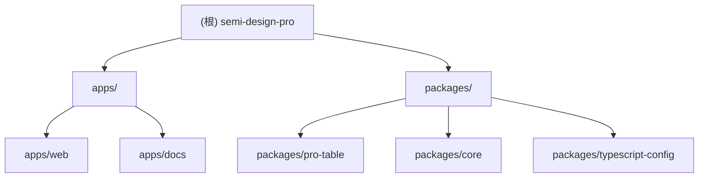

# Semi Design Pro

> 基于 Turborepo 的 Semi Design 企业级组件库项目
> 最后更新：2025-11-26T20:56:42

## 变更记录 (Changelog)

### 2025-11-26
- **初始化 AI 上下文**：完成项目架构文档化，识别出 2 个应用和 3 个包

---

## 项目愿景

Semi Design Pro 是一个基于 Turborepo 的 monorepo 项目，旨在构建基于 Semi Design 的企业级 React 组件库和配套应用。项目采用 pnpm workspace 和 Turborepo 进行多包管理，提供组件库、文档站点和演示应用。

## 架构总览

### 技术栈
- **构建工具**: Turborepo 2.6.1 + pnpm 9.0.0
- **语言**: TypeScript 5.9.2
- **框架**: React 19.2.0
- **UI 库**: Semi Design (@douyinfe/semi-ui)
- **打包工具**:
  - 应用：Vite 7.x
  - 组件库：tsup 8.x
- **文档**: VitePress 2.0.0-alpha.13
- **代码质量**: Biome 2.3.6, ESLint, Prettier

### 核心特性
- React 19.2 + React Compiler 支持
- 严格的 TypeScript 配置
- Turborepo 缓存和任务编排
- ESM 优先的模块系统

## 模块结构图



## 模块索引

| 模块路径 | 类型 | 职责描述 | 主要技术 |
|---------|------|---------|----------|
| [apps/web](./apps/web/CLAUDE.md) | 应用 | Vite + React 演示应用 | Vite, React 19, React Compiler |
| [apps/docs](./apps/docs/CLAUDE.md) | 应用 | VitePress 文档站点 | VitePress, Markdown |
| [packages/pro-table](./packages/pro-table/CLAUDE.md) | 组件包 | Semi Design 高级表格组件 | React, Semi UI, tsup |
| [packages/core](./packages/core/CLAUDE.md) | 核心库 | 共享核心工具和类型 | TypeScript, tsup |
| [packages/typescript-config](./packages/typescript-config/CLAUDE.md) | 配置 | 共享 TypeScript 配置 | TypeScript |

## 运行与开发

### 环境要求
- Node.js >= 22
- pnpm 9.0.0

### 常用命令

```bash
# 安装依赖
pnpm install

# 开发模式（启动所有应用）
pnpm dev

# 开发指定应用
turbo dev --filter=web
turbo dev --filter=docs

# 构建所有包
pnpm build

# 代码检查
pnpm lint

# 代码格式化
pnpm format
```

### Turbo 任务说明

| 任务 | 依赖 | 缓存 | 说明 |
|------|-----|------|------|
| `build` | `^build` | 是 | 构建产物：dist/、build/ |
| `dev` | - | 否 | 开发模式（持久化任务） |
| `lint` | - | 是 | 代码检查 |
| `test` | `build` | 是 | 运行测试 |

## 测试策略

- **单元测试**: 使用 Vitest（在 pro-table、core 包中配置）
- **当前状态**: 测试框架已配置但暂无具体测试文件
- **建议**:
  - 为核心组件添加单元测试
  - 为工具函数添加测试覆盖

## 编码规范

### TypeScript 配置
- 严格模式 (`strict: true`)
- ES2022 目标
- NodeNext 模块解析
- 强制索引访问检查 (`noUncheckedIndexedAccess: true`)

### 代码风格
- **Lint**: Biome (packages)、ESLint (apps/web)
- **Format**: Prettier
- **命名规范**:
  - 包名：`@semi-pro/*`
  - 组件：PascalCase
  - 文件：kebab-case 或 PascalCase（组件）

### 包结构规范
```
packages/[package-name]/
├── src/               # 源代码
├── dist/              # 构建产物（自动生成）
├── package.json       # 包配置
├── tsconfig.json      # TS 配置
├── tsup.config.ts     # 打包配置（如需要）
└── biome.json         # 代码检查配置（如需要）
```

## AI 使用指引

### 为 AI 准备的上下文
1. **快速理解项目**: 阅读本文档的"架构总览"和"模块索引"
2. **模块详情**: 点击模块链接查看各模块的 CLAUDE.md
3. **修改代码前**:
   - 检查相关模块的 peerDependencies
   - 确认是否需要更新其他依赖包
   - 遵循现有的 TypeScript 严格配置

### 常见 AI 任务
- **添加新组件**: 在 packages/ 下创建新包，参考 pro-table 的结构
- **修改构建配置**: 查看 turbo.json 和各包的 tsup.config.ts
- **添加文档**: 在 apps/docs 下添加 Markdown 文件

### 约束与注意事项
- 保持 React 19 和 React Compiler 兼容性
- 组件库需声明 Semi UI 为 peerDependency
- 使用 workspace protocol（`workspace:*`）引用内部包
- 所有包必须支持 ESM 格式
- 遵循 Turborepo 的任务依赖关系

---

**项目根目录**: `D:\learn\semi-design-pro`
**Monorepo 工具**: Turborepo 2.6.1
**包管理器**: pnpm 9.0.0
